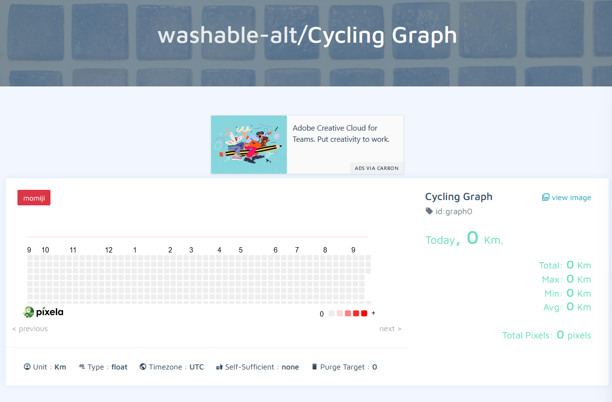

Day 37 

Using pixela API 

Learning about POST/PUT/DELETE Request

Learning about using authentication token as the request header in the post request

# Example post request: response = requests.post(url=, json=, header=) 
# print json: print(response.text)

# Creating a new Pixela user
`POST` - /v1/users/
- token [`required`] (token is hashed and saved)
- username [`required`] (username for this service)
- agreeTermsOfService [`required`] (specify yes or no whether you agree to the terms of service.)
- notMinor [`required`] (specify yes or not whether you are a minor)
- thanksCode [`optional`] (requires a patreon subscription to unlock features like Retina)

# Change the authentication token for the specified user
`PUT` - /v1/users/`username`
- Request `HEADER` : `X-USER-TOKEN` [`required`]
- Request Body (as json): `newToken` [`required`]
                `thanksCode` [`optional`]

# Deletes the specified registered user
`DELETE` - /v1/users/`username`
- Request `HEADER` : `X-USER-TOKEN` [`required`]

# Create a new graph
`POST` /v1/users/`username`/graphs
- Request `HEADER` : `X-USER-TOKEN` [`required`]
- Request Body (as json): `id` [`required`] (id for identifying the pixelation graph)
                          `name` [`required`] (It is the name of the pixelation graph)
                          `unit` [`required`] (It is a unit of the quantity recorded in the pixelation graph i.e.km)
                          `type` [`required`] (It is the quantity to be handled in the graph. Only int or float are supported.)
                          `color` [`required`] (Defines the display color of the pixel in the pixelation graph.)

