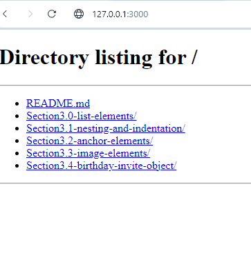
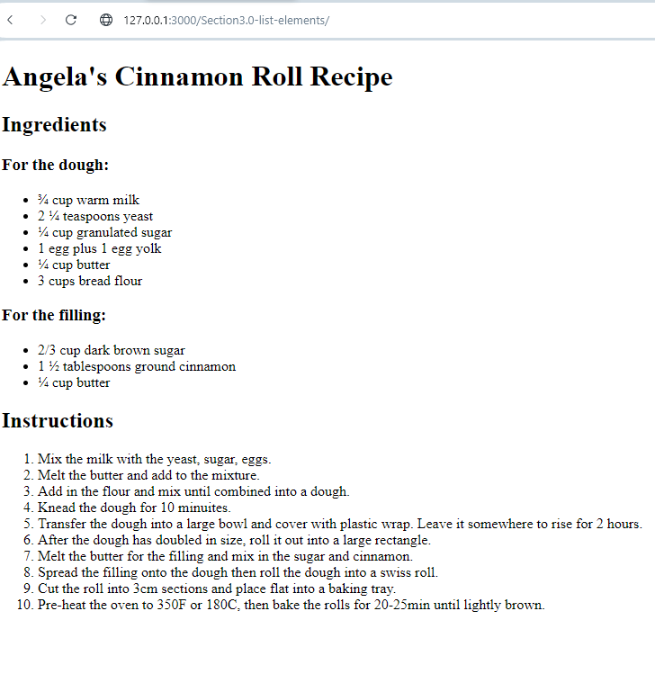
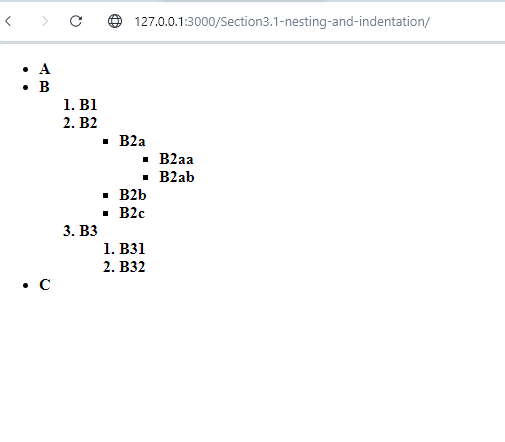
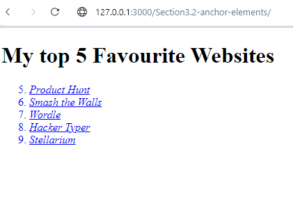
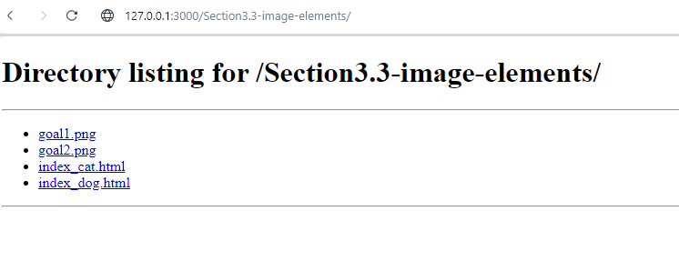

Day 42 

Takeaways for Day 42

`Section 3.0`:
Ordered list - `ol` - 1,2,3...
Unordered list -`ul` - bulletpoints
<ul><li></li></ul>

`Section 3.1`
indentation for better view to the eye
``

`Section 3.2`
anchor elements
<`a href=""`><`/a`>

`Section3.3`
image elements
`src` attribute = src link
`alt` attribute = alt link
`class` attributes are used to style elements

