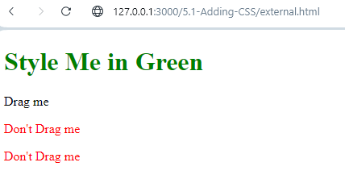

Day 43

Introduction to CSS - Cascading Style Sheets

# Inline CSS (for 1 element)

<html style="background:blue">
</html>

# Internal CSS (for 1 webpage)

Usually put in `head` segment

<head>
    
<head>

# External CSS - It has a self-closing tag and a link to point to another css file (for 1 or more websites)

<head>
    <link
        rel="stylesheet" 
        type="text/css"
        href="./styles.css"
    />
</head>

Element Selector - targets the h1 tag
h1{
    color:blue;
}
Class Selector - targets the class tags - many elements
<h2 class="red-text">Red</h2>
.red-text{
    color: red
}

Universal selector - apply to all elements in page
*{
    color:red;
}

Id Selector - one element - completely unique
<h2 id="main">Red</h2>

#main{
    color:red
}

Attribute selector

a[atrribute] {
    color: red;
}

