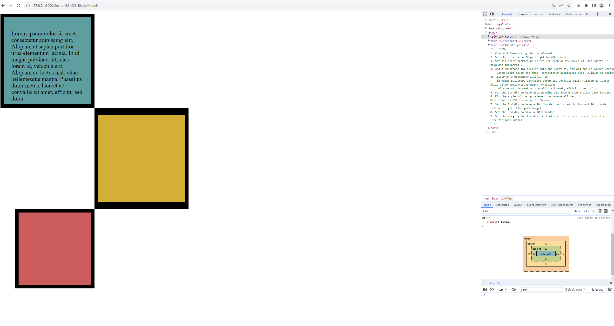

Day 44 

README.md

/* Write your CSS code here. */
    /* 1. Make the background of the webpage "antiquewhite"
    2. Make the h1 "whitesmoke"
    3. Make the background of the h1 "darkseagreen"
    4. Make the h2 #FAF8F1
    5. Make the background of the h2 "#C58940" */

Font Size 12: 
1px - 1/96th inch - 0.26mm
1pt - 1/72nd inch - 0.35mm
1em - 100% of parent
1rem - 100% of root (relative to the root of the html file)

Section 6.1
  <!-- TODOs
  1. Change the color of 
Color
 to "coral" color.
  2. Change the font size of 
Font Size
 to 2X the size of the root font size.
  3. Change the font weight of 
Font Weight
 to 900.
  4. Change the font family of 
Font Family
 to the Google font Caveat with regular (400) font weight.
  Link: https://fonts.google.com/specimen/Caveat
  5. Change the 
Text Align
 to right align.
  6. Change the the root (html element) font size to 30px -->

  To comment one line - keyboard shortcut key - Ctrl + K, then Ctrl + C

Section 6.2 - CSS Inspection 
Separate three-dots in CSS Overview Under Dev Tools in Google Chrome - Can check the favourite color of a webpage

Section 6.3 - CSS Box Model

border: 30px solid black;
border-width: 0px 10px 20px 30px; [(top left bottom right)]
padding: 20px; [push border out by 20px on all sides]
margin: 100px; [area outside the border]

Section 6.4
<!-- 
  TODO: Create a motivational post website.
Style it how ever you like. 
Look at the goal image for inspiration.
But it must have the following features:
1. The main h1 text should be using the Regular Libre Baskerville Font from Google Fonts:
  https://fonts.google.com/specimen/Libre+Baskerville
2. The text should be white and background black.
3. Add your own image into the images folder inside assets. It should have a 5px white border.
4. The text should be center aligned.
5. Create a div to contain the h1, p and img elements. Adjust the margins so that the image and text are centered on the page. 
  Hint: You horizontally center a div by giving it a width of 50% and a margin-left of 25%.
  Hint: Set the image to have a width of 100% so it fills the div. 
6. Read about the text-transform property on MDN docs to make the h1 uppercase with CSS.
  https://developer.mozilla.org/en-US/docs/Web/CSS/text-transform 
-->

No Copyright Infringement is intended for Andrew Grove photo
Image from https://encrypted-tbn2.gstatic.com/licensed-image?q=tbn:ANd9GcS9tZdXj32k2pTv-gCwf-756mk2Ixt5DjhI-S1pyoOiLB5lay1sNfo8efnQEAvYRB_CE0nHTW7FvsSYFm0