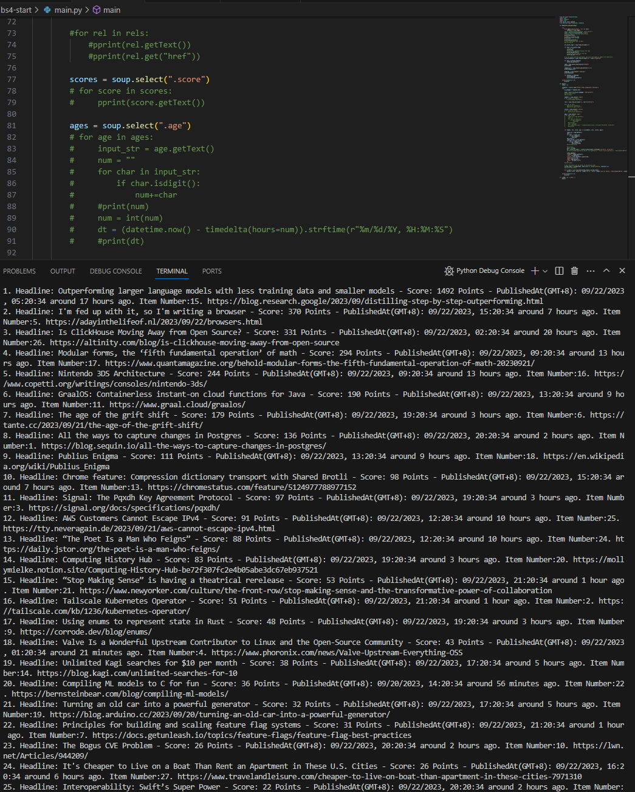
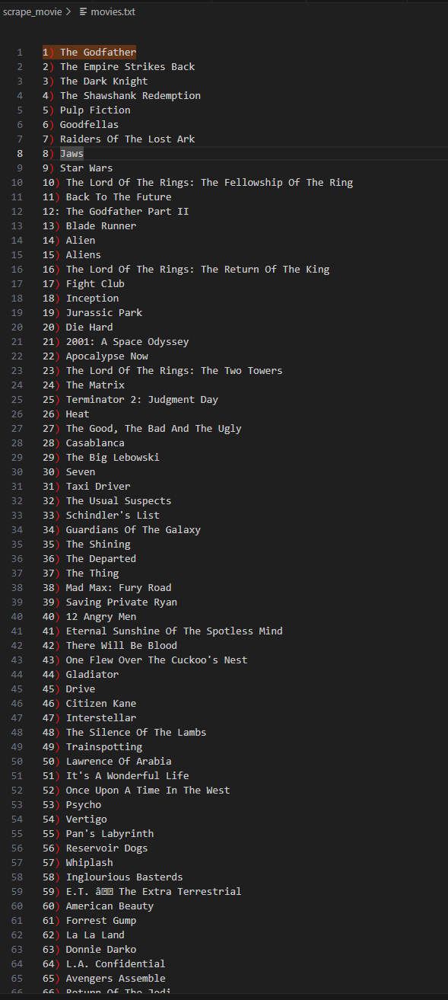

Day45

Web Scraping using BeautifulSoup

Steps:
1. Open the website url using `with open(url, `rb`) as file` and save it into a `contents` variable - this is to prevent unicode error
2. lxml can extract structured data from web pages, making it a popular choice for web scraping projects. 
3. Create a BeautifulSoup object called soup as a lxml parser
4. Prettify the soup using `prettify`
5. Methods of soup 
- find_all(name=), then tag.getText()
- find_all(name=, class_=), then tag.getText() or get the attributes using tag.get("`attributeName`")
- select_one(selector="#name") [this is for the `id` tag]
- select(".heading") [this is for the `class` tag]

Is Web Scraping Legal? 
In late 2019, the US Court of Appeals denied LinkedIn's request to prevent HiQ, an analytics company, from scraping its data. 
It showed that any data that is publicly available and not copyrighted is fair game for web crawlers, i.e. Cannot commercialise copyrighted content, Youtube video, Medium blog etc. 
Cannot scrape data behind authentication 

look at robots.txt - Disallow: /x? /r? /vote? /reply? /submitted?

