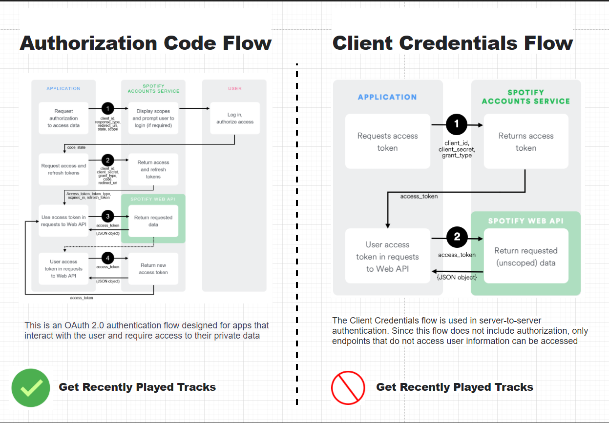
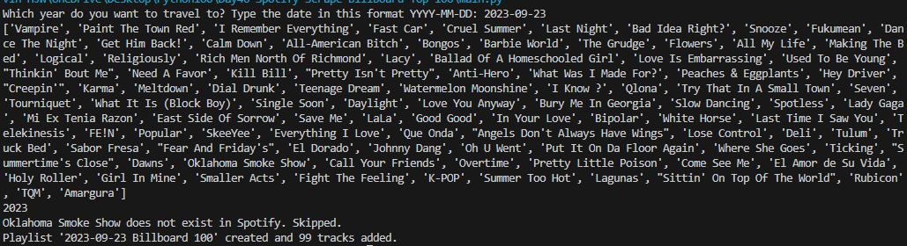
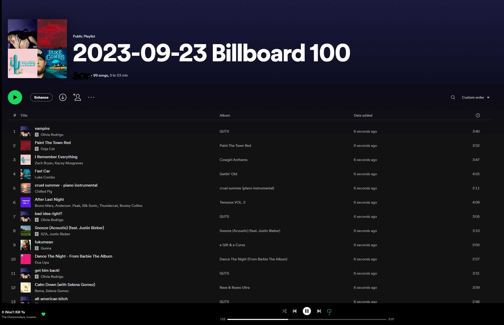

Day 46 - Spotify Scrape Billboard Top 100

Step 1:
Scraping the Billboard Hot 100
Create an input() prompt that asks what year you would like to travel to in YYYY-MM-DD format
`Which year do you want to travel to? Type the date in this format YYYY-MM-DD`
Scrape using beautifulsoup
Use regex to find partial tags 

Step 2:
Authentication With Spotify
Go to developer dashboard and make a new Spotify App.
Callback url - https://www.example.com/callback
Save it in the dotenv file.
Set scope to "playlist-modify-private"
Get the current user

Step 3:
Search songs using sp.search
HINT 1: You can use the query format "track: {name} year: {YYYY}" to narrow down on a track name from a particular year.

HINT 2: Sometimes a song is not available in Spotify, you'll want to use exception handling to skip over those songs.

HINT 3: pprint() might help you visualise the result better. https://docs.python.org/3/library/pprint.html

Step 4:
Create a new private playlist with the name "YYYY-MM-DD Billboard 100"
Add songs found in Step 3 to the new playlist.

 A problem I faced was not being able to set the Spotify playlist despite setting the Public to False and using the scope to be playlist-modify-private. 

 Used postman and it remains a public playlist.

