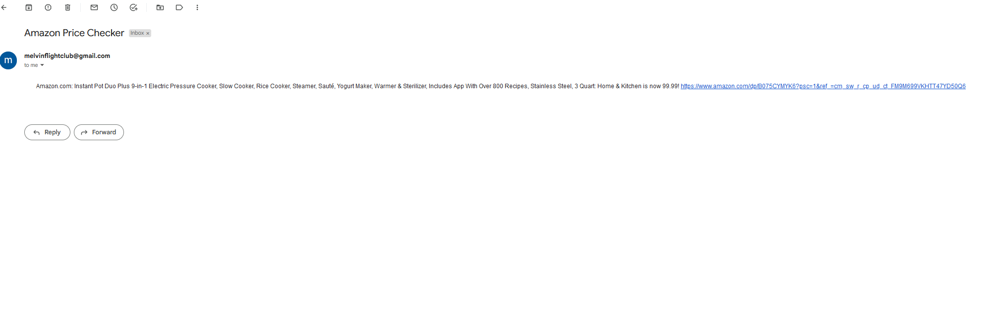

Day 47
Automated Amazon Price Checker Project

Step 1:
Get url 

Step 2: 
Scrape the price

Step 3:
Compare price with whatever target price you want

Step 4: 
If price is lower than target price send email

Test.py explores the clicking of buttons as the price may be different because of the functionalities of the product such as size, or style for instance 

