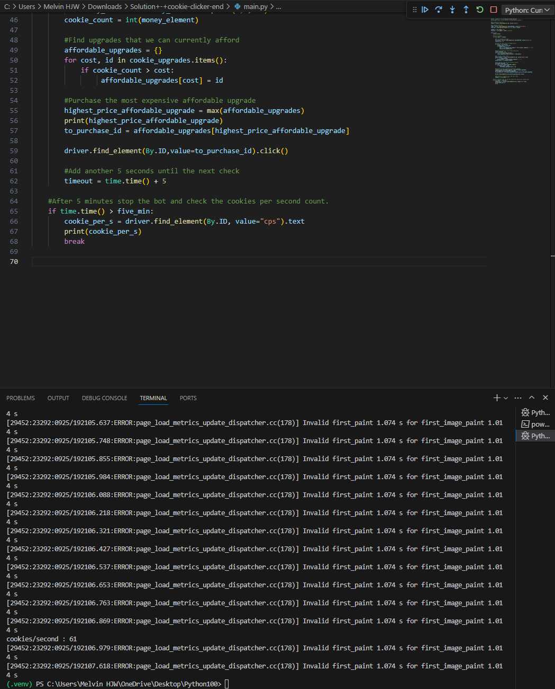
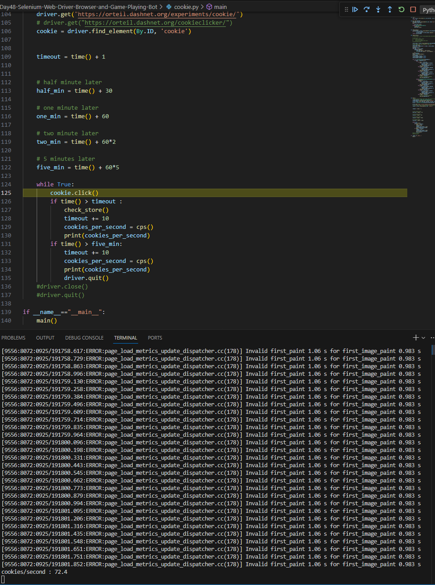

Day 48

Selenium-Web-Driver-Browser

Selenium is an automated web browser that can help to scrape web page data. 

tutorial.py

driver.find_element(By.CLASS_NAME, value=)
driver.find_element(By.NAME, value=)
driver.find_element(By.CSS_SELECTOR, value=)
driver.find_element(By.XPATH, value=)

multiple element finds example
driver.find_elements(By.CLASS_NAME, value=)
driver.find_elements(By.NAME, value=)
driver.find_elements(By.CSS_SELECTOR, value=)
driver.find_elements(By.XPATH, value=)

Cookie Clicker Game

Baselining Angela's solution for clicking on the maximum possible value, it is 61 cookies per second without any mouse interaction on the browser.
Credits to partial solution by ellakkis on Udemy, I added some lines of code myself for the maximising of cookies per second. It is around 72.4. The idea is probably to get as many cursors as possible earlier on, but up to some point, saving up for `Mine` and etc could be better.

For Cookie Clicker Game refer to cookie.py and main_angela_solution.py.
I saw another solution which was quite readable. Credits to Pixelum2022 on Udemy. 

